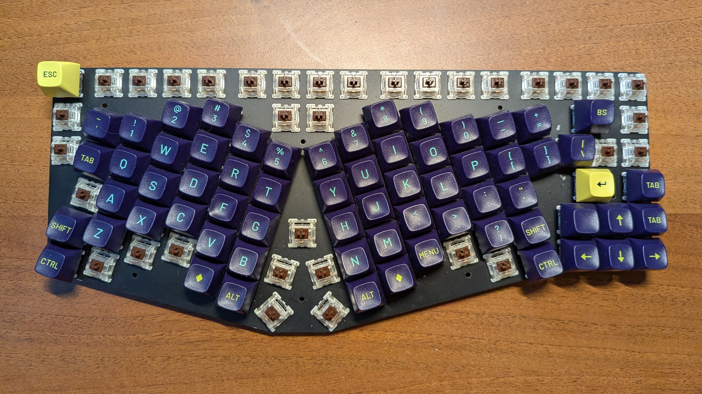
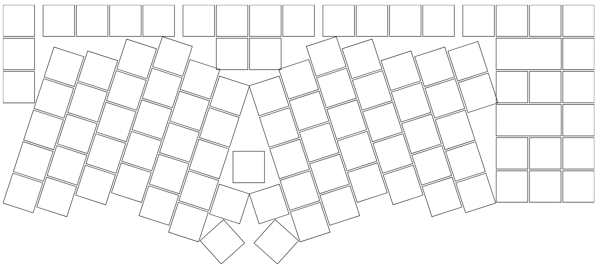

# US8EK: Unibody Split 80% Ergo Keyboard

```
unibody split 80% ergo keyboard
------- ----- --- ----
   |      |    |   |
   |      |    |   \--- orthogonal key layout 
   |      |    \------- Fn, arrow and navigation keys, no numpad
   |      \------------ rotated halves
   \------------------- one piece
```



**An ergonomic mechanical keyboard designed for developers and power users**

The perfect balance of familiarity and ergonomics with this innovative unibody split keyboard featuring:
- **Ergonomic design** - Matrix layout optimized for each hand
- **Single body construction** - No sliding or separation issues
- **Complete navigation cluster** - Dedicated arrows, modifiers, and function keys for seamless transition from standard keyboards
- **Fully open source** - Hardware and firmware available to the community


## Design Philosophy

Real-world usage analysis (by the author, Jaromír Malenko) revealed a striking truth: navigation keys dominate our daily keyboard interactions. Running [KeyboardFrequencies](https://github.com/PeterTheobald/KeyboardFrequencies) for one week showed navigation keys are used **14× more** than the most frequent alphanumeric key!

**Usage statistics:**
```
down: 11,952    (most used key!)
up: 10,320      
right: 7,115    
left: 6,239     
backspace: 2,723
...
a: 854          (most used letter)
```

This data confirms what many developers and content creators experience daily - we spend more time navigating code, file systems, and documents than typing new content. **JMKB prioritizes this reality.**

**Effortless hotkey access** - Complex shortcuts like IntelliJ's `Ctrl + Alt + F9` (Force Run to Cursor) remain natural and quick. No more layer juggling or muscle memory retraining.

**Dedicated function keys** - Essential F-keys are always accessible, supporting professional workflows from debugging to media control.

**Unibody meets ergonomics** - Enjoy the comfort of split design without the frustration of shifting halves or cable management between sections.


## Lessons from Real Experience

**Kyria insights:**
- ✅ Validated matrix layout comfort
- ✅ Confirmed need for dedicated navigation keys
- ❌ Two-piece instability (even 20cm tethering couldn't fully solve this)

**X-Bows learnings:**
- ✅ Appreciated familiar key arrangement
- ✅ Confirmed unibody preference
- ❌ Proprietary limitations (keycap compatibility, missing home/end keys)

**JMKB synthesis:** Combines the best aspects while addressing every pain point encountered.


## Technical Solution

### Design
 generated in Ergogen

### Hardware Components
- **Controller:** [Frood RP2040](https://42keebs.eu/shop/parts/controllers/frood-rp2040-pro-micro-controller/) - has 25 I/O pins. The keyboard actually uses only 23 pins, so any Pro Micro microcontroller can be used.
- **Switches:** Glorious PC Gaming Race Gateron (120-pack); or any other switches
- **Diodes:** 1N4148 - get pack of 100 pieces
- **Wire:** 17 AWG = 1.04 mm² nicely fits between switch leg and stem
- **Keycaps:** MT3 profile - Ergonomic sculpting with premium feel; or any other keycaps 
- **Plate:** Laser-cut steel. See build guide.

### Build guide

1. Study **Primary guides** below. 

2. Get componenents.

   2.1. Laser cut the [plate](10-design/out/switch_plate_3dprint.dxf).

   2.2. Order hardare components.

3. Build - Solder it together.

   - Q: Which columns/rows shall be soldered to which pin?

     A: You can use any reasonable pin (not power, ground or USB-C). If you wire it according to the following diagrame, then you don't need to modify the configuration in *kb.py*.

     TODO Add diagram.

4. Configure microcontroller.

   4.1. Setup CircuitPython.

        Documentation and download are available at [https://circuitpython.org/board/42keebs_frood/](https://circuitpython.org/board/42keebs_frood/).

   4.2. Copy kmk & your configuration to the microcontroller.
        
        Copy [20-sw/20-kmk/*](20-sw/20-kmk) to root of your microcontroller. (So, there will be a *kmk* directory and *boot.py*, *main.py* and *kb.py* files in the root.)

5. Optional: Customize your configuration in *main.py*.
   
   See [kmk_firmware documentation](https://github.com/KMKfw/kmk_firmware/tree/main/docs/en). 

### Software
[KMK](https://github.com/KMKfw/kmk_firmware)


## Resources & Inspiration

**Primary guides**
- Let's Design A Keyboard With Ergogen:
  [Part 1 - Units & Points](https://flatfootfox.com/ergogen-part1-units-points/),
  [Part 2 - Outlines](https://flatfootfox.com/ergogen-part2-outlines/),
  [Part 3 - PCB](https://flatfootfox.com/ergogen-part3-pcbs/),
  [Part 4 - Offline Ergogen, External Footprints, & Cases](https://flatfootfox.com/ergogen-part4-footprints-cases/),
  [Part 5 - KiCAD, Firmwares, & Assembly](https://flatfootfox.com/ergogen-part5-kicad-firmware-assembly/)

- [How to Build a Handwired Keyboard](https://www.youtube.com/watch?v=hjml-K-pV4E&t=554s) by Joe Scotto

- [Frood](https://github.com/piit79/Frood) microcontroller documentation

**Research**
- Community inspiration for **wiring**. I did not want to use heatshrink and strip the wire; ale I wanter to use diode legs instead of a wire.
  - [3D printed and hand wired corne](https://www.reddit.com/r/HandwiredKeyboards/comments/1nthd3h/3d_printed_and_hand_wired_corne)
  - [4x10 Ortho Handwire](https://www.reddit.com/r/HandwiredKeyboards/comments/1o70lsv/4x10_ortho_handwire)
  - [Hex and Uf2 questions](https://www.reddit.com/r/HandwiredKeyboards/comments/1nns3z9/hex_and_uf2_questions)
  - [Reach - wireless split staggered running ZMK](https://www.reddit.com/r/HandwiredKeyboards/comments/1o72p64/reach_wireless_split_staggered_running_zmk)
  - [Second Handwire Complete](https://www.reddit.com/r/HandwiredKeyboards/comments/1kvkm4v/second_handwire_complete)
  - [Second Handwire Up and Running](https://www.reddit.com/r/HandwiredKeyboards/comments/1mdjikk/second_handwire_up_and_running/#lightbox)
  - [Final v4n build](https://www.reddit.com/r/HandwiredKeyboards/comments/1mm9syf/final_v4n_build)
  - [Built myself a handwired corne](https://www.reddit.com/r/HandwiredKeyboards/comments/1j9lmwk/built_myself_a_handwired_corne/#lightbox)
  - [Introducing the HellSplit!](https://www.reddit.com/r/HandwiredKeyboards/comments/1m4534o/introducing_the_hellsplit)
  - [First board I've Ever Designed / Handwired / 3D Printed [Open Source]](https://www.reddit.com/r/HandwiredKeyboards/comments/1lpn7hz/first_board_ive_ever_designed_handwired_3d)

- [Pro Micro & Fio V3 Hookup Guide](https://learn.sparkfun.com/tutorials/pro-micro--fio-v3-hookup-guide/hardware-overview-pro-micro)
- [nice!nano](https://nicekeyboards.com/docs/nice-nano/)

**Keyoboards**
- [X-Bows Nature](https://x-bows.com/products/x-bows-nature)

  

- [Another custom hand wired board](https://www.reddit.com/r/MechanicalKeyboards/comments/1fskfku/another_custom_hand_wired_board/)
  
  


## Project Plan

### Future Enhancements
- [ ] Add a key next to backspace (Currently, backspace is a 2u key and we can add one more key to the layout)
